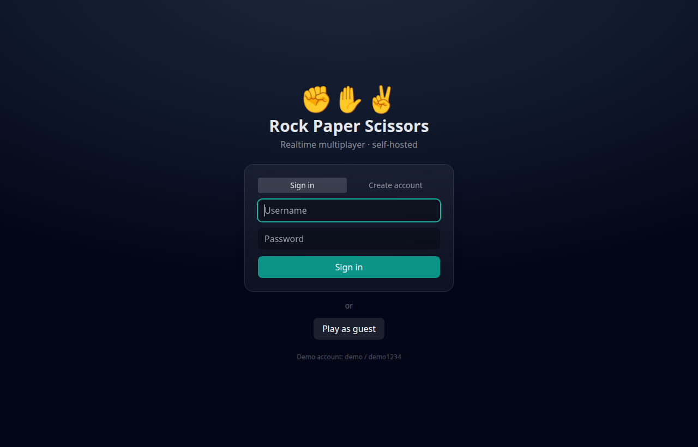
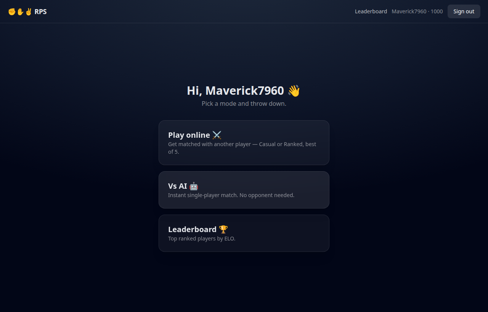
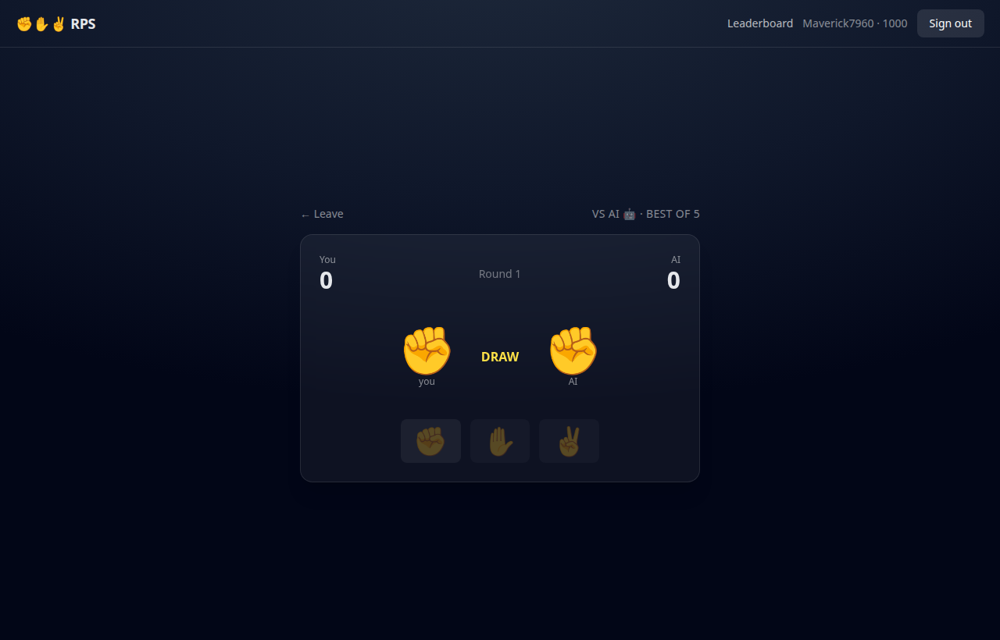
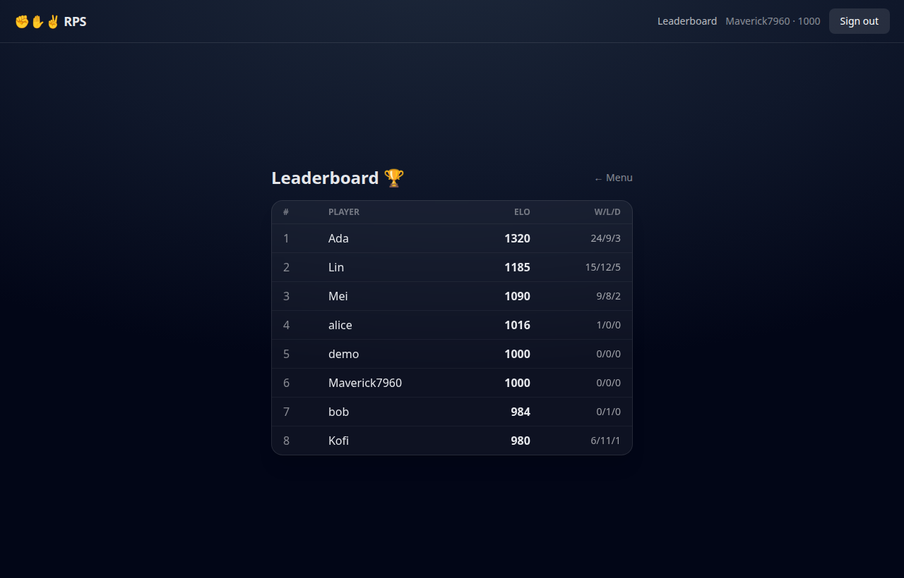

# Rock Paper Scissors — Remaster ✊✋✌️

Realtime, multiplayer Rock Paper Scissors you can host yourself. A 2023 Firebase
prototype rebuilt from the ground up to run **fully local with one command** and
**no cloud accounts, API keys, or subscriptions**.

> **Status:** Working. The full stack builds and runs with
> `docker compose up --build`, and realtime PvP, ranked ELO, VS-AI, and session
> auth are all verified end-to-end. See [`docs/DECISIONS.md`](docs/DECISIONS.md)
> for the rationale behind the rewrite and [`TODO.md`](TODO.md) for the backlog.

## Screenshots

| Sign in (with guest play) | Main menu |
| --- | --- |
|  |  |

| Live round (Vs AI) | Leaderboard |
| --- | --- |
|  |  |

## Why this exists

The original used Firebase Auth + Realtime Database and a separate matchmaking
worker — it couldn't run without a Google project, and the client judged its own
moves. This remaster keeps the fun and rebuilds the foundation:

- **No vendor lock-in** — Postgres + WebSockets instead of Firebase. Clone and
  `docker compose up`.
- **Authoritative server** — matchmaking and round resolution happen on the
  server, not the client.
- **Real progression** — accounts, a ranked **ELO** ladder, and persisted match
  history. (Casual was the only working mode in the original; Ranked and VS-AI
  were stubs.)

## Stack

| Layer    | Tech |
| -------- | ---- |
| Client   | React 18, Vite, TypeScript, Tailwind CSS, Socket.IO client |
| Server   | Node, Express, Socket.IO, Prisma |
| Database | PostgreSQL |
| Auth     | `express-session` + Postgres session store + bcrypt (guest play supported) |
| Delivery | Docker Compose (Postgres + server + nginx-served client) |

## Game modes

- **Casual** — realtime PvP. Queue up, get matched, best-of-5.
- **Ranked** — same, but wins/losses move your ELO and are saved.
- **VS AI** — fully local single-player. No opponent or network needed, so a
  solo visitor always gets a working demo.

## Quick start (Docker — recommended)

Requires Docker + Docker Compose. No other setup.

```bash
git clone <this-repo> rock-paper-scissors-remaster
cd rock-paper-scissors-remaster
cp .env.example .env          # defaults work out of the box
docker compose up --build
```

Then open **http://localhost:8080**. The API/Socket.IO server runs on
**http://localhost:4000**. Postgres data persists in the `pgdata` volume;
migrations and a small seed run automatically on first boot.

To play realtime PvP locally, open a second browser window (or an incognito
window), sign in as a different user (or use **Play as guest**), and queue on
both.

## Local development (without Docker)

```bash
# 1. Start just Postgres
docker compose up -d postgres

# 2. Server
cd server
npm install
cp ../.env.example .env        # set DATABASE_URL host to localhost
npx prisma migrate dev
npm run dev                     # http://localhost:4000

# 3. Client (new terminal)
cd client
npm install
npm run dev                     # http://localhost:5173
```

## Configuration

All config is via environment variables — see [`.env.example`](.env.example).
Key ones: `DATABASE_URL`, `SESSION_SECRET`, `CLIENT_ORIGIN` (server CORS/cookie
origin), and `VITE_SERVER_URL` (where the browser reaches the server, baked into
the client build).

## How it works

```
Browser (React) ──HTTP──> Express      auth (sessions in Postgres)
       │                     │
       └──── WebSocket ──> Socket.IO ── matchmaking queue (in memory)
                             │          active matches  (in memory)
                             └──Prisma──> Postgres (users, ELO, match history)
```

The server is the single source of truth: it pairs queued players, runs each
round, enforces the rules, tracks the best-of-5 score, and writes the result
(plus ELO changes for ranked) to Postgres.

## Project structure

```
client/        React + Vite + Tailwind front end
server/        Express + Socket.IO + Prisma back end
  prisma/      schema + seed + migrations
docs/          architecture decisions, screenshots
docker-compose.yml
```

## Limitations & roadmap

- Single server instance (active-match state is in memory). Scale path: the
  Socket.IO Redis adapter — see [`docs/DECISIONS.md`](docs/DECISIONS.md).
- No automated test suite yet; verification is a documented manual smoke test.
- The admin dashboard (from the original `RPS-Admin`) is deferred.

See [`TODO.md`](TODO.md) for the full backlog.

## Credits

Remaster of an early personal project (`rps-firebase` / `RPS-server`, 2023).
Rebuilt 2026 as a self-hostable portfolio flagship.
